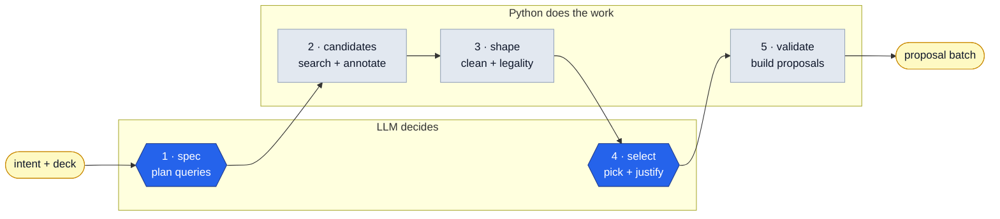

# The retrieval pipeline

How Familiar suggests cards. This documents the system **as it is built**
today. For the original design rationale (and why control was inverted away
from the model), see [RETRIEVAL_PIPELINE_SPEC.md](RETRIEVAL_PIPELINE_SPEC.md) —
that is a pre-implementation spec, not a description of the current code.

Code lives in `backend/app/pipeline/`. The entry point is
`service.build_suggestions()`, reached from the chat loop when the model calls
the `suggest_cards` tool.

## The core idea

Deterministic Python owns retrieval, filtering, legality, and ranking. The LLM
is bounded to two calls: **plan queries** (stage 1) and **pick from a curated
shortlist** (stage 4). Everything the code *can* decide (what's legal, on-color,
already in the deck, how cards rank) it decides, so correctness never depends on
the model getting card facts right.

The one thing Python genuinely can't do — judge whether a card *fits this
specific deck* (combos with the commander, completes a line, is a synergy trap)
— is exactly what stage 4 is for, and why it gets the commander + current deck
as context and runs with thinking on. See "Model & thinking policy" below.

## Stages

The model only decides what to look for (1) and which results to keep (4);
deterministic Python does the searching, filtering, legality, and everything
after. In the diagram, hexagons are LLM calls and rectangles are Python.

Read it as a relay: control bounces from the model (plan the search) to Python
(run it, filter it) back to the model (pick from the results) and back to Python
(validate into proposals). Only stages 1 and 4 are LLM calls. The output is the
exact shape `propose_deck_changes` returns.

| Stage | File | What it does |
|---|---|---|
| 1 spec | `pipeline/spec.py` | Turns intent + colour identity into a few Scryfall queries. The harness **enforces** `id<=<identity>` and `f:commander` on every query (`enforce_query`) regardless of what the model wrote, so legality can't leak. Parse is tolerant (`parse_spec`): coerces/repairs, drops blanks/dupes, caps count. |
| 2 candidates | `pipeline/candidates.py` | Runs each query via `scryfall.search_pipeline` (EDHREC-ordered, deduped printings), **broadening any query that underfills** (see below), merges keeping the best-ranked first, annotates each card with EDHREC synergy/inclusion where the commander's page has it, sorts by EDHREC rank, caps the pool. EDHREC failure degrades to an empty synergy map — never sinks retrieval. |
| 3 shape | `pipeline/shaping.py` | Strips the Scryfall object to what stage 4 needs, precomputes `legal_in_deck` (commander-legal, colour identity within the commander's, not banned, not already in the deck) and functional roles, dedupes by `oracle_id`, caps legal-cards-first, and renders the deterministic text block stage 4 reads (`render_pool`), including each card's EDHREC play rate and synergy. |
| 4 select | `pipeline/selection.py` | The LLM picks from the pool and justifies each pick **against this deck**. Given the commander (with oracle text), current cards by category, and strategy notes. Picks not in the pool, or marked ILLEGAL, are dropped in `parse_selection` (hallucination guard). |
| 5 validate | `pipeline/validate.py` | Turns the picks into pending `DeckProposal` rows by reusing `propose_deck_changes` — the same approval gate the conversational path uses. A pick that fails validation never becomes a proposal. |

`build_suggestions` (`pipeline/service.py`) wires them and returns a
`SuggestionResult` whose `proposals` field is the exact shape
`propose_deck_changes` returns — so it plugs into the existing approve/deny SSE
+ REST workflow with no new plumbing.

## Query broadening (stage 2)

The cheatsheet tells the model "if a query would return very few cards, loosen
it", but the model emits queries **blind** — it never sees a result count, so it
cannot act on that instruction. A single over-tight query therefore contributed
nothing, and because stage 2 ran each query exactly once, nothing downstream
could recover. This was the largest single cause of a thin pool.

`pipeline/broaden.py` makes the instruction actionable by the harness: run the
query, count the hits, and if it underfilled (< 8 by default) drop **one**
constraint and re-run, up to 3 rounds. Relaxation order is most-arbitrary-first:
mana value bound, keyword, power/toughness, oracle tag, rarity.

Two invariants:

- **Legality is never relaxed.** `id<=` and `f:commander` survive every round,
  so broadening cannot leak an illegal card into the pool.
- **Intent is never fully relaxed.** A query stripped of every term describing
  what a card *does* (`o:`, `t:`, `otag:`, `is:`, `produces:`, `keyword:`) is no
  longer a search for anything — verified live, `id<=br f:commander` cheerfully
  returns Sol Ring and Command Tower. Broadening stops rather than degrading a
  search into generic staples. Contributing nothing beats contributing
  confident noise.

The `otag:` step matters more than it looks. Tagger's vocabulary is a
**hierarchy, and the bulk export ships only leaf taggings** — `otag:removal`,
`otag:tutor`, and `otag:sacrifice-outlet` all resolve on Scryfall (which expands
ancestors server-side) but have zero rows in the bulk file. Slugs are therefore
not guessable, and a model inventing a plausible tag name is a routine failure
that returns exactly zero cards. Dropping the tag is often the whole fix.

`SuggestionResult.debug["broadened"]` maps each original query to the relaxed
queries actually tried, so a suggestion that quietly widened its search is
inspectable rather than silent.

## EDHREC as a candidate source (stage 2)

EDHREC used to be a garnish. Stage 2 fetched the commander's page only to
annotate cards Scryfall had already returned, so a card EDHREC recommends that
no query happened to match could not enter the pool at all — the best available
signal for "what actually goes in this deck" was structurally unable to
contribute a candidate. Worse, `shaping._STRIP_FIELDS` omitted `edhrec`, so even
the annotation was discarded before stage 4 read it.

`pipeline/edhrec_source.py` makes the page a real source: collect its cardlists,
rank them, hydrate the names through the local card index in one query, and
merge them into the pool ahead of query hits.

### The two numbers

EDHREC gives each card `synergy` and `inclusion`, and only one is what its name
suggests.

`inclusion` is **a raw deck count, not a rate** — verified 2026-08-15, it equals
`num_decks` exactly. The rate is `num_decks / potential_decks`, and the
denominator varies per card because a newer card has had fewer eligible decks
(2,893 for a recent printing vs 20,489 for an established one). Ranking on
`inclusion` therefore sorts by raw popularity *and* quietly buries new cards.
The rate is computed rather than read.

`synergy` is a true differential: inclusion in this commander's decks minus
inclusion in decks of the same colours. Measured on Korvold, the "High Synergy
Cards" list averages ~+0.42 while "Top Cards" averages ~+0.15 at comparable play
rates — same popularity, opposite meaning.

### The off-meta knob

`off_meta` (0.0–1.0, per deck, default 0.25) trades play rate against synergy
when ranking recommendations. This is what stops every deck converging on the
same hundred cards. Measured live on Korvold:

| `off_meta` | Top of pool |
|---|---|
| 0.0 | Forest, Command Tower, Swamp, Sol Ring — every Jund deck's staples |
| 1.0 | Mayhem Devil, Tireless Provisioner, Pitiless Plunderer — the treasure-sacrifice engine specific to Korvold |

EDHREC-sourced cards sort ahead of query hits, preserving the order `rank` put
them in. **Source is tracked explicitly, not inferred from the presence of an
`edhrec` key** — query hits carry one too (from the synergy map), so a
truthiness check puts both groups in the same bucket and lets generic staples
outrank the commander-specific picks. That bug is pinned by a regression test.

## Model & thinking policy

The two LLM stages are **not symmetric**, and the defaults reflect that
(`build_suggestions`):

- **Stage 1 (query planning): fast model, thinking OFF.** Mapping intent to a
  few Scryfall queries is mechanical, and `enforce_query` fixes legality
  regardless — so deep reasoning buys nothing here.
- **Stage 4 (selection): fast model, thinking ON.** This is the only place
  deck-aware *fit* judgment can happen. It receives the commander + current deck
  (`_render_deck_context`) and reasons about combos/synergy, so thinking earns
  its cost. It stays on the fast model to keep latency sane.

**Stage-4 latency is dominated by OUTPUT volume, not prompt size.** Measured over
repeated samples on an identical pool: a thinking selection call emits a median
**9,476 completion tokens** against 489 without, and at ~90 tok/s that generation
*is* the whole wait. Shrinking the prompt does nothing — halving it measured
slightly *slower*.

The only lever that moves it is `reasoning_effort` (`budget_tokens` is silently
ignored by the API). On the same pool:

| Effort | Median latency |
|---|---|
| provider default | 93.2s |
| `medium` | 73.7s |
| `low` | 40.8s |

`low` returned the same theme-aware picks, including both changelings that
trigger the commander twice, so it is the default (`SELECT_REASONING_EFFORT` in
`.env`; set empty to restore the provider default). A full suggestion runs ~62s
end to end.

Both stages default to the provider's fast model (`get_fast_model()` →
`deepseek-v4-flash`). This is a deliberate reversal of the older "Pro
everywhere" default: routing two heavy Pro+thinking calls made a
congested-API `suggest_cards` take ~80s; Flash with the split above brings it
back to ~10–25s with picks that are as good or better (Python already did the
retrieval/ranking). Override per call with `model` / `spec_thinking` /
`select_thinking` (tests pin a fake provider this way).

### Deck-aware selection

`_render_deck_context(snapshot)` builds the compact block stage 4 sees:
commander(s) with oracle text (the key combo signal), current cards grouped by
category (names only — full oracle text for 99 cards would blow up the prompt
and latency), and strategy notes. The selection system prompt tells the model to
judge *fit* against this deck, not just keyword-match the intent, and to name the
commander/card a pick works with in its reason. Without this block the model was
blind to the commander and could only match the intent in a vacuum.

## Timing, timeouts, and diagnosing a stall

`build_suggestions` logs per-stage timings (`pipeline: <stage> done in Ns`) and
emits a `WARNING` for any stage over 20s; the same timings are returned in
`SuggestionResult.debug["timings"]`. Logging is configured in `app/main.py`
(`LOG_LEVEL` in `.env`, default INFO) so these actually reach the console. When a
suggestion "hangs," the logs name the stage — almost always stage 4, dominated
by DeepSeek API latency, which is highly variable (a trivial call is ~1.5s; a
real selection call has ranged 6–50s under load).

LLM calls have a request timeout (`LLM_TIMEOUT_SECONDS`, default 90s, applied in
both providers via the factory) with `max_retries=1`, so a stalled call fails
visibly instead of hanging on the SDK's 600s default. Scryfall (10s) and EDHREC
(15s) have their own httpx timeouts.

The shared Scryfall/EDHREC singletons (`get_scryfall_client`,
`get_edhrec_client`) are used across FastAPI's threadpool, so each guards its
`httpx.Client` with a lock — concurrent requests serialise rather than racing a
non-thread-safe client.

## How the chat loop drives it

`suggest_cards` is one tool among several. The engine gates *entry* (the model
elects to call it) but everything after entry is deterministic. Because
`build_suggestions` returns the standard proposal shape, the engine streams and
anchors its batch exactly like a `propose_deck_changes` batch.

Note the engine's **post-proposal rule** (`chat/engine.py`): once any proposal
batch is emitted in a turn — from `suggest_cards` or `propose_deck_changes` —
the model is offered **only** `withdraw_pending_proposals` on subsequent
iterations, so it can trim a card or two but cannot add another batch or run
more research. The batch is revealed to the UI **once, at turn end**, carrying
only the proposals that survived trimming (`_settled_proposal_batch`), so cards
never flash in and back out. This is what stops the propose→withdraw→propose
churn that used to burn the 12-iteration budget and drop the turn.

## Testing

- `tests/test_pipeline_spec.py` / `test_pipeline_selection.py` — stage parse/repair and hallucination-guard.
- `tests/test_pipeline_candidates.py` / `test_pipeline_shaping.py` — deterministic merge/dedupe/cap and rendering.
- `tests/test_pipeline_golden.py` — a golden render fixture; keep the pool-render output stable.
- `tests/test_pipeline_service.py` — end-to-end with a two-stage fake provider, including that the selection prompt carries the commander context.

Fakes pin `model`/`thinking` so no network is hit. The golden test asserts the
exact stage-4 text block; changing `render_pool` will (intentionally) require
updating the fixture.

## Local first (September 2026)

Before stage 1 runs, `pipeline/local_retrieval.py` builds a pool from the
local card index: the intent's words are matched to the fine roles in
`roles.py` and each role's slug rules become one tag query, and the intent's
remaining content words are searched in name, rules text, and type line.
Colour identity is applied there. When that pool reaches `local_pool_min`
(25) the model's query-planning call and the Scryfall API queries are skipped
entirely; EDHREC's recommendations still lead the pool. A thin local pool
falls back to stage 1 as before. `debug.local_pool` and `debug.stage1_skipped`
say which path a suggestion took.
